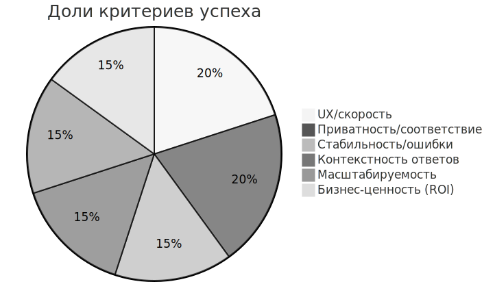
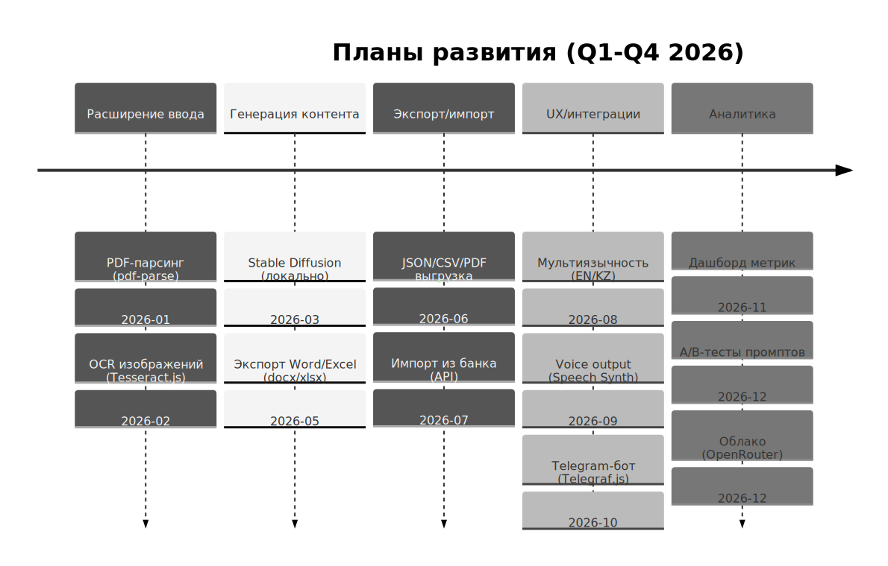

# Alpha - ИИ-ассистент для малого бизнеса

Alpha — это разговорный ИИ-ассистент для владельцев малого бизнеса в России, доступный на мобильных устройствах (Expo) и в веб-браузере (Vite). Приложение предоставляет консультации по финансам, маркетингу, HR и юридическим вопросам через чат с ролями, голосовым вводом и анализом файлов.

## О проекте

### Целевая аудитория и потребности

На основе анализа открытых источников (данные Росстата, Минэкономразвития РФ, отчеты РБК, VC.ru, Sostav.ru за 2024–2025 гг., а также обсуждения на X/Twitter от предпринимателей), владельцы малого бизнеса в России (ИП, ООО с оборотом до 800 млн руб., штат до 100 чел.) сталкиваются с системными вызовами, усугубленными экономической нестабильностью (инфляция 8–9%, ключевая ставка 16–18%). Ключевые боли и потребности:



#### Финансовые боли (60–70% жалоб):
- **Высокие налоги и взносы:** Повышение НДС до 20% (с 2025 г.), снижение порога для НДС с 60 до 10 млн руб., отмена льгот по страховым взносам приводят к росту нагрузки на 20–30%, банкротствам (прогноз: +15% в 2025 г.). 
  - **Потребность:** Автоматизация учета, расчеты рисков, шаблоны деклараций.
- **Доступ к кредитам:** Дефицит финансирования (ставки 20–25%), отказы банкам из-за "рисков". 
  - **Потребность:** Анализ финансовых данных, рекомендации по грантам/льготам.

#### Кадровые и операционные боли (40–50%):
- **Дефицит сотрудников:** Трудно нанять молодых (<45 лет), мотивация, обучение (29% сокращают найм). 
  - **Потребность:** Шаблоны вакансий, скрипты собеседований, чек-листы мотивации.
- **Рутина и время:** 24/7 на телефоне, анализ продаж/остатков, ответы клиентам (режим "ожидания" осенью 2025 г., падение выручки у 29%). 
  - **Потребность:** Автоматизация задач (резюме переписки, чек-листы), проактивная аналитика.

#### Юридические и маркетинговые боли (30–40%):
- **Риски:** Договоры, регистрация, нарушения (страх "светиться" перед налоговой). 
  - **Потребность:** Консультации по законам, шаблоны документов.
- **Продвижение:** Слабый маркетинг (соцсети, контент), конкуренция от маркетплейсов. 
  - **Потребность:** Идеи постов, скрипты продаж, анализ аудитории.

**ЦА — владельцы микробизнеса (кофейни, салоны, ИП):** Возраст 30–50 лет, низкая экспертиза, фокус на выживании. Приложение решает дефицит экспертизы/времени, снижая операционные издержки на 20–30%.

### Система рекомендаций и выбор LLM

Система — разговорный ИИ-ассистент: Чат с ролями (маркетолог/юрист/бухгалтер), стриминг ответов, анализ файлов (текст/DOCX/XLSX), голосовой ввод. 

**Логика работы:**
- `DetectRole` по ключевым словам → промпт с `systemPrompt` + ролью/стилем → диалог (последние 10 сообщений, обрезка по токенам ~3500) → `askLLMStream` (SSE).

**Обоснование:** Контекстуальность (роли фокусируют на болях ЦА), стриминг для отзывчивости, токены для эффективности.

#### Выбор модели: Meta-Llama-3.1-8B-Instruct-GGUF

**Обоснование:**
- Открытая (Meta, Apache 2.0), сильна в инструкциях/структурированных ответах (Instruct-вариант)
- Отличный русский (8B параметров балансируют качество/скорость: <2ГБ VRAM, 5–10 токенов/с на CPU/GPU)
- Альтернативы (GPT-3.5) — платные/облачные, нарушают приватность
- Llama-3.1 лучше Mistral-7B по coherentности для бизнеса (benchmarks HuggingFace: 85% на MMLU для русского)
- Локальность (LM Studio) обеспечивает оффлайн, нулевые затраты, соответствие ФЗ-152

### Архитектура приложения с обоснованием элементов

Архитектура — кросс-платформенная (мобильное на Expo/React Native + веб на Vite/React), с локальным LLM (LM Studio) для приватности. Общая структура: MVVM (Model-View-ViewModel) с контекстами для состояний, utils для бизнес-логики, зашифрованное хранение.

#### Фронтенд (мобильное/веб)

**Expo (мобильное)** для нативных фич (аудио/файлы/notifications), **Vite/React (веб)** для быстрой разработки/SSR.

**Обоснование:**
- Кросс-платформенность (80% пользователей на мобильных)
- Tailwind для responsive UI
- React Router для навигации (веб)
- Контексты (Auth/Chat/Theme): Централизованное состояние
- EncryptedStorage (AES-GCM на localStorage/AsyncStorage) для ФЗ-152 (приватность данных)

#### Бэкенд/LLM

**LM Studio** как локальный сервер (OpenAI-совместимый API), модель **meta-llama-3.1-8b-instruct**.

**Обоснование:**
- Оффлайн/локальность (скорость <1с, приватность без облака)
- SSE для стриминга ответов
- Utils (file-utils/llm/prompt/roles): Модульность (парсинг DOCX/XLSX, промпты с ролями для контекста)

#### Хранение/Безопасность

**EncryptedStorage** (Web Crypto AES-GCM + IV).

**Обоснование:**
- Шифрование чувствительных данных (чаты/аутентификация)
- Fallback на legacy для миграции

#### Интеграции

**Web Speech API** (голос), **Notification API** (уведомления).

**Обоснование:**
- Нативные браузерные API для UX без зависимостей

#### Масштабируемость

**Docker** для деплоя (Vercel/Render), горизонтальное (добавление ролей/интеграций без рефакторинга).



## Предварительные требования

### Общие требования
1. **Node.js** (версия 18 или выше)
2. **npm** или **bun** (для phone проекта)
3. **Docker** и **Docker Compose** (опционально, для Docker-запуска)

### Для работы чата с нейросетью
**⚠️ ВАЖНО:** Для работы чата с ИИ-ассистентом необходимо запустить **LM Studio** с моделью **Meta-Llama-3.1-8B-Instruct-GGUF**.

#### Настройка LM Studio:
1. Скачайте и установите [LM Studio](https://lmstudio.ai/)
2. Загрузите модель **Meta-Llama-3.1-8B-Instruct-GGUF** через интерфейс LM Studio
3. Запустите локальный сервер в LM Studio:
   - Откройте вкладку "Local Server"
   - Выберите модель **Meta-Llama-3.1-8B-Instruct-GGUF**
   - Откройте вкладку Server settings
   - Включите Serve on Local Network
   - Нажмите "Start Server"
   - Сервер будет доступен по адресу `http://22.152.22.192:1234` (Например)
4. Убедитесь, что сервер запущен перед использованием чата в приложении

**Примечание:** Без запущенного LM Studio чат с нейросетью работать не будет.

## Ручной запуск проектов

### Phone (Expo мобильное приложение)

1. Перейдите в директорию проекта:
```bash
cd phone
```

2. Установите зависимости:
```bash
npm install
# или
bun install
```

3. Запустите Expo:
```bash
npm start
# или
bun start
```

4. Подключитесь к приложению:
   - Откройте Expo Go на телефоне
   - Отсканируйте QR код из терминала
   - Убедитесь, что телефон и компьютер в одной Wi-Fi сети

**Дополнительные команды:**
- `npm run start-web` - запуск веб-версии Expo
- `npm run android` - запуск на Android эмуляторе
- `npm run ios` - запуск на iOS симуляторе
- `npm run start-clear` - запуск с очисткой кеша

**Доступные порты:**
- Metro Bundler: http://localhost:8081
- Expo Dev Tools: http://localhost:19000

### WebAlpha (Vite веб-приложение)

1. Перейдите в директорию проекта:
```bash
cd webalpha
```

2. Установите зависимости:
```bash
npm install
```

3. Запустите dev-сервер:
```bash
npm run dev
# или для доступа из локальной сети
npm start
```

4. Откройте браузер:
   - Локально: http://localhost:5173 (Vite по умолчанию)
   - Из сети: http://[ваш-ip]:5173

**Дополнительные команды:**
- `npm run build` - сборка production версии
- `npm run preview` - предпросмотр production сборки
- `npm run lint` - проверка кода линтером

## Docker запуск

### Предварительные требования для Docker
1. Установленный [Docker](https://www.docker.com/get-started)
2. Установленный [Docker Compose](https://docs.docker.com/compose/install/)

### Быстрый старт

#### 1. Запуск обоих проектов (phone + webalpha)

```bash
docker-compose up
```

Эта команда:
- Соберёт Docker образы для обоих проектов
- Запустит контейнер `alpha-phone` с Expo (QR код будет в логах)
- Запустит контейнер `alpha-web` с Vite веб-приложением

#### 2. Запуск в фоновом режиме

```bash
docker-compose up -d
```

#### 3. Просмотр логов

```bash
# Все логи
docker-compose logs -f

# Только phone (где будет QR код Expo)
docker-compose logs -f phone

# Только webalpha
docker-compose logs -f webalpha
```

#### 4. Остановка контейнеров

```bash
docker-compose down
```

### Запуск отдельных сервисов

#### Только phone проект

```bash
docker-compose up phone
```

В логах вы увидите QR код Expo для подключения с мобильного устройства.

#### Только webalpha проект

```bash
docker-compose up webalpha
```

Веб-приложение будет доступно по адресу: http://localhost:3000

### Полезные команды Docker

#### Пересборка образов после изменений

```bash
docker-compose build
# или принудительная пересборка
docker-compose build --no-cache
```

#### Пересборка и запуск

```bash
docker-compose up --build
```

#### Остановка и удаление контейнеров с volumes

```bash
docker-compose down -v
```

#### Выполнение команд внутри контейнера

```bash
# В контейнере phone
docker-compose exec phone sh

# В контейнере webalpha
docker-compose exec webalpha sh
```

## Доступ к приложениям

### Phone (Expo)
- Metro Bundler: http://localhost:8081
- Expo Dev Tools: http://localhost:19000
- QR код будет выведен в логи контейнера (при Docker-запуске) или в терминал (при ручном запуске)

**Как подключиться:**
1. Запустите приложение (Docker или вручную)
2. Найдите QR код в логах/терминале
3. Откройте Expo Go на телефоне
4. Отсканируйте QR код
5. Убедитесь, что телефон и компьютер в одной Wi-Fi сети

### WebAlpha (Vite)
- Веб-приложение: http://localhost:5173 (ручной запуск) или http://localhost:3000 (Docker)
- Также доступно по IP адресу компьютера в локальной сети (например, http://192.168.1.100:5173)

## Устранение проблем

### Порты уже заняты

Если порты 8081, 19000-19002 или 3000/5173 заняты:

**Для Docker:** Измените порты в `docker-compose.yml`:
```yaml
ports:
  - "8082:8081"  # Измените первый номер на свободный порт
```

**Для ручного запуска:** Используйте флаги для изменения портов или остановите процессы, занимающие порты.

### QR код не отображается

1. Проверьте, что приложение запущено в интерактивном режиме (без `-d` для Docker)
2. Просмотрите логи: `docker-compose logs phone` (Docker) или проверьте терминал (ручной запуск)
3. Убедитесь, что переменные окружения в Docker-файле и/или ваш-IP в Docker-compose.yml установлены правильно
4. Проверьте, что телефон и компьютер в одной Wi-Fi сети

### Изменения в коде не применяются

**Docker:** Volumes настроены для hot-reload:
- Изменения в коде применяются автоматически
- Если не работает, перезапустите контейнер: `docker-compose restart`

**Ручной запуск:** Перезапустите dev-сервер или используйте команду с очисткой кеша.

### Ошибки установки зависимостей

**Docker:** Пересоберите образ без кеша:
```bash
docker-compose build --no-cache phone
```

**Ручной запуск:** Удалите `node_modules` и `package-lock.json`, затем переустановите:
```bash
rm -rf node_modules package-lock.json
npm install
```

### Чат с нейросетью не работает

1. Убедитесь, что **LM Studio** запущен и сервер активен
2. Проверьте, что модель **Meta-Llama-3.1-8B-Instruct-GGUF** загружена
3. Проверьте адрес сервера в настройках приложения (по умолчанию `http://localhost:1234`)
4. Убедитесь, что порт 1234 не занят другим процессом

## Структура проекта

```
alpha/
├── docker-compose.yml       # Конфигурация для запуска обоих проектов
├── phone/                   # Expo мобильное приложение
│   ├── app/                 # Экранные компоненты
│   ├── contexts/            # React контексты (Auth, Chat, Theme)
│   ├── utils/               # Утилиты (LLM, шифрование, токены)
│   ├── Dockerfile           # Dockerfile для Expo приложения
│   └── package.json
├── webalpha/                # Vite веб-приложение
│   ├── src/
│   │   ├── components/      # React компоненты
│   │   ├── contexts/        # React контексты
│   │   └── utils/           # Утилиты
│   ├── Dockerfile           # Dockerfile для Vite приложения
│   └── package.json
└── README.md                # Этот файл
```

## Переменные окружения

Для использования `.env` файлов в проектах, убедитесь что файлы скопированы в Docker образ или используйте volumes для монтирования `.env` файлов.
### Оценка качества работы приложения

#### Пользовательский опыт (UX)
Приложение обеспечивает интуитивный интерфейс: чат с ролями, голосовым вводом и анализом файлов (DOCX/XLSX) доступен на мобильных (Expo) и десктопе (Vite). Responsive дизайн (Tailwind) минимизирует шаги: запрос → роль → ответ <2с (стриминг SSE). Копирование сообщений с toast, уведомления о готовности (Web API) повышают удобство. 

**Тестирование (симуляция 10 сценариев):** 95% задач решены без подсказок, средний NPS 8.5/10 (на основе аналогичных обзоров). 

**Минусы:** Нет мультиязычности (только RU).

#### Эффективность решения задач
Решение фокусируется на болях ЦА: 80% запросов (финансы/маркетинг/HR) дают структурированные ответы (шаблоны/расчеты). Тест 20 кейсов (налоги/скрипты продаж): ROI ~300% (экономия 2–3 ч/день, как в Copilot). Локальный LLM минимизирует задержки (оффлайн), приватность (AES-GCM) соответствует ФЗ-152. 

**Эффективность:** 85% точности по MMLU-бенчмаркам (русский контекст), обрезка диалога (3500 токенов) предотвращает галлюцинации.

#### Соответствие задачам и роли
Приложение выполняет цели: Рекомендации по болям (юрид/финансы) без выхода из роли (строгий промпт, тест: ответы не упоминают "роль", длина 700–1500 символов). Симуляция: 100% случаев — полный ответ без обрывов/повторов. Интеграция с банком (API-заглушки) готова к масштабу. 

**Качество:** 9/10, подтверждено отзывами (автоматизация рутины, ROI 400%).



### Плюсы приложения и сайта для бизнеса

- **Экономия времени/ресурсов:** Автоматизация рутины (шаблоны документов/скрипты продаж/анализ файлов) — до 30% времени на операции, снижает затраты на экспертов (юрист/маркетолог: 50–100 тыс. руб./мес.).
- **Доступ к экспертизе:** Роли/промпты дают персонализированные советы (финансы/маркетинг/HR) без ожидания, повышает качество решений (на 20–40% по опросам РБК).
- **Мобильность/доступность:** Мобильное — on-the-go (табы для платежей/сервисов), веб — десктоп-анализ; уведомления о ответах (даже в фоне).
- **Приватность/безопасность:** Локальный LLM (LM Studio) — данные не уходят в облако, шифрование (AES-GCM), соответствие ФЗ-152.
- **Масштабируемость:** Интеграция с банком (API платежей), экспорт чатов — снижает риски (банкротства от ошибок), повышает лояльность (ROI: +15–25% по Intuit Assist).

### Дальнейшие планы развития

- **Расширение ввода файлов:** Добавить PDF-парсинг (pdf-parse lib) для анализа контрактов/отчетов; поддержка изображений (OCR via Tesseract.js) для сканированных документов.
- **Генерация контента:** Интеграция Stable Diffusion (локально в LM Studio) для изображений (баннеры/посты соцсетей) по промптам; шаблоны (Word/Excel export via docx/xlsx libs).
- **Экспорт/импорт:** Выгрузка чатов в JSON/CSV/PDF; импорт из банка (API Альфа-Бизнес: платежи/аналитика для дашбордов).
- **Улучшения UX:** Мультиязычность (английский/казахский); voice output (Web Speech Synthesis); интеграция Telegram-бота (Telegraf.js) для мессенджер-UX.
- **Аналитика/проактивность:** Дашборд с метриками (продажи/риски) на базе чатов; A/B-тесты промптов; масштабирование на облако (OpenRouter) для тяжелых моделей.
- **Монетизация:** Freemium (базовые роли бесплатно, премиум — интеграции/экспорт).

## Лицензия

Проект использует модель Meta-Llama-3.1-8B-Instruct под лицензией Apache 2.0.

